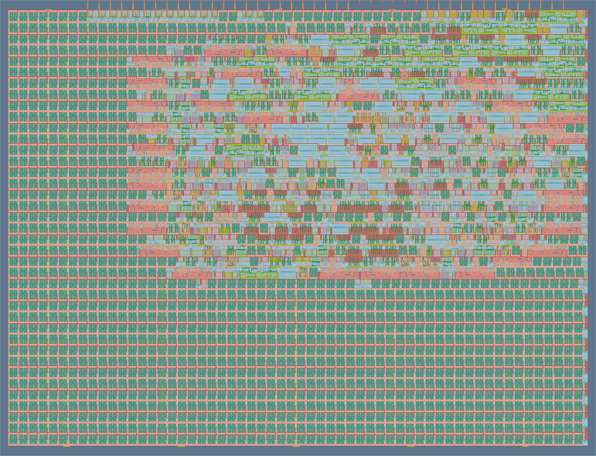

# Collatz Sequence Accelerator




A hardware accelerator designed to compute the Collatz sequence for a given positive integer using RTL design principles.

---

## About the Project

The Collatz conjecture is a famous unsolved problem in number theory.
It states that for every positive integer, repeated application of a simple set of rules will eventually reduce the number to `1`.

This project implements the Collatz sequence in hardware using Verilog and targets FPGA/ASIC workflows.

---

## Rules of the Collatz Sequence

Given a positive integer:

```math
n = 27
```

Apply the following rules repeatedly:

### If `n` is odd

```math
n = 3n + 1
```

### If `n` is even

```math
n = \frac{n}{2}
```

The sequence eventually converges to:

```text
... → 4 → 2 → 1
```

---

## Example Sequence

For:

```math
n = 27
```

The sequence begins as:

```text
27 → 82 → 41 → 124 → 62 → 31 → ... → 4 → 2 → 1
```

and eventually reaches:

```text
1
```

---

## Features

- RTL implementation using Verilog
- FPGA compatible design
- ASIC-oriented architecture
- Automated testbench verification
- TinyTapeout compatible workflow
- Efficient arithmetic operations using shift logic

---

## Project Structure

```bash
├── src/        # RTL source files
├── test/       # Testbench files
├── docs/       # Documentation
└── README.md
```

---

## Simulation

Compile and run the testbench using:

```bash
iverilog -o sim ./src/project.v ./test/tb.v
vvp sim
```

---

## Documentation

- [Project Documentation](docs/info.md)

---

## License

[LICENSE](./LICENSE).
